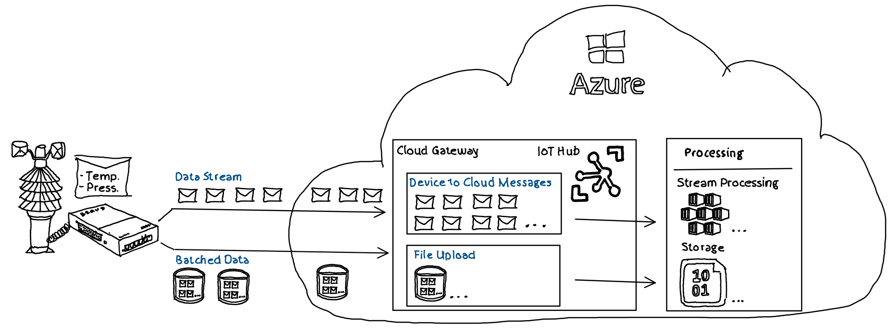
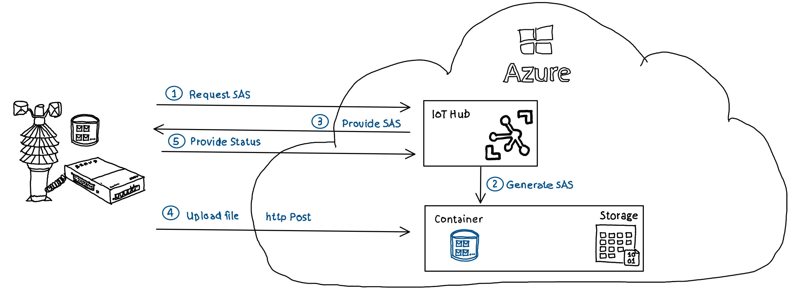

# Azure IoT Hub - File Upload - Device Quota Exceeded

## Basics
In IoT scenarios devices often provide data which need to be analyzed or processed as **stream of data** with low latency. For a weather station this could be e.g. every minute the transfer of current temperature, current air pressure etc. Additionaly there is quite often a need to upload **batched data** to the cloud for analysis or storage. To stay with the example of a weather station this could be the mentioned temperature and air pressure only with a lower frequency of e.g. every second.

    

### File upload quota

IoT Hub enforces a quota of 10 concurrent file uploads per device. This limitation should not have any major restrictions in the day-to-day usage of IoT Hub file upload functionality. However, if a device attempts to upload a file multiple times, potentially due to errors or unexpected communication hickups, this limitation may cause problems and must be handled explicitly.

### Stream of data

Details how device to cloud messages can be send to IoT Hub can be found [here](https://learn.microsoft.com/en-us/azure/iot-hub/iot-hub-devguide-messaging#sending-device-to-cloud-messages-to-iot-hub) and is not part of this repo.

## File upload - Behind the scenes

### Overview 

IoT Hub acts for the file upload as a dispatcher instead of handling file uploads directly. IoT Hub provides on request of a device an [Azure Account Storage Shared Access Signature](https://learn.microsoft.com/en-us/azure/storage/common/storage-sas-overview) which can be used by the device to http post a file directly to an Azure Storage Account. 

The actual file upload takes place in direct communication between the Device and Azure Storage Account. The device uses the Shared Access Signature (SaS) Uri provided by IoT Hub to perform an http post to a file in an Azure Storage Account container and to update IoT Hub regarding the file upload:

  

1. Device requests SAS Uri from IoT Hub
2. IoT Hub generates SAS Uri from linked Storage Account
3. IoT Hub provides SAS Uri to device
4. Device uses SAS Uri to post file to Storage Account
5. Device updates IoT Hub regarding successful / failed upload

## Details

### REST endpoints

To provide the mentioned functionality IoT Hub provides two REST endpoints. 

- Post [Request SAS Uri](https://learn.microsoft.com/en-us/rest/api/iothub/device/create-file-upload-sas-uri):

        {iot hub}.azure-devices.net/devices/{deviceId}/files/{filename}*

    to request a SAS Uri from IoT Hub

- Post [Update file upload status](https://learn.microsoft.com/en-us/rest/api/iothub/device/update-file-upload-status):

        {iot hub}.azure-devices.net/devices/{deviceId}/messages/files/notifications/{correlationId}

    to notify IoT Hub of a completed upload, wether it was successful or failed.

The "SAS Uri request" returns beside the SAS Uri and other information a so called CorrelationId. This CorrelationId can be used to update IoT Hub using the "update file upload status post" that a specific upload has been performed.

### IoT Hub Quota

To be able to enforce the upload quota, IoT Hub keeps track of requested SAS URIs and for which SAS URIs a status has been reported back. 

Only by reporting back status for a requested SAS IoT from a device Hub can reduce the number of current parallel uploads. It is irrelevant  whether the upload was successful or failed. If no update is provied IoT Hub will not reduce the number of current parallel uploads. Even if the upload was successful performed. This could lead to a situation where NO file upload is currently performed but IoT Hub reports a "Quota exceed message" requesting a new SAS Uri. 

### Auto release / SAS life time

IoT Hub regularly releases requested SAS Uris where no status update has been provided. Requested SAS Uris will be released if the TTL of the specific SAS Uri has been expired. 

The time to live (TTL) of a requested SAS Uri can be set by configuring the IoT Hub instance. Here's an Azure Command Line Interface (Azure CLI) example . ***$uploadSasTtl is set in this example to one hour***.

    $uploadNotificationMaxDelivery = 10
    $uploadNotificatonTtl = 1
    $uploadSasTtl = 1
    $uploadNotifications = "true"
    $uploadNotificationTtl = 1
    $storageAuthType = "keyBased"

    az iot hub update `
        --name $hubName `
        --fileupload-storage-auth-type $storageAuthType `
        --fileupload-storage-connectionstring $storageConnectionString `
        --fileupload-storage-container-name $storageContainerName `
        --fileupload-notifications $uploadNotifications `
        --fileupload-notification-max-delivery-count $uploadNotificationMaxDelivery `
        --fileupload-notification-ttl $uploadNotificationTtl `
        --fileupload-sas-ttl $uploadSasTtl 

***Attention***: There's no guarantee that IoT Hub releases requested SAS Uris immediately after the TTL has expired. Therefore application design ***should NOT*** rely on auto release of requested SAS URIs. A custom mechanism need to be implemented. Please check *"RequestAndRelease"* [here](src/FileUpload.DemoDevice/Program.cs) as a simplified example for a custom implementation. 

## SDK support / Example application
The Azure IoT SDK simplifies the upload of files by hiding some of the implementation details. Most of the specific language IoT SDKs provide a deprecated method **UploadToBlobAsync()** which should no longer be used:  

        try {
            await _deviceClient.UploadToBlobAsync(fileName.ToLower(), fileStreamSource);
        } catch (Exception)
        {
            return false; 
        }

*UploadToBlobAsync* hides all implementation details but by nature also doesn't allow fine granular control if problems (e.g. device restart, network break downs etc.) occure. Instead usage of: 

    1. _deviceClient.GetFileUploadSasUriAsync();
    2.       Code to upload using the Azure Storage SDK
    3. _deviceClient.CompleteFileUploadAsync();

is suggested.

## Example Code

An end-to-end example creating and configuring an IoT Hub in Azure as well as dotnet demo code using multiple ways to upload files is provided [here](src/README.md)